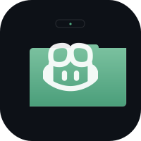

# Copilot Island 🏝️

<p align="center">
  
</p>

<p align="center">
  <strong>GitHub Copilot CLI를 MacBook 노치에서</strong><br/>
  노치에서 세션을 실시간으로 모니터링하고 AI 대화를 확인하세요.
</p>

<p align="center">
  <a href="https://github.com/lordmos/copilot-island/releases/latest">
    
  </a>
  <a href="LICENSE">
    
  </a>
  
  
</p>

<p align="center">
  <a href="README.md">English</a> ·
  <a href="README.zh-Hans.md">简体中文</a> ·
  <a href="README.zh-Hant.md">繁體中文</a> ·
  <a href="README.ja.md">日本語</a> ·
  <strong>한국어</strong> ·
  <a href="README.fr.md">Français</a> ·
  <a href="README.de.md">Deutsch</a> ·
  <a href="README.pt.md">Português</a> ·
  <a href="README.es.md">Español</a>
</p>

---

## Copilot Island란?

Copilot Island는 **무료 오픈소스 macOS 노치 앱**으로, MacBook의 노치에 상주하며 GitHub Copilot CLI가 실시간으로 하고 있는 모든 작업을 보여줍니다.

[ClaudeIsland](https://github.com/celestialglobe/claude-island)에서 영감을 받아, GitHub Copilot CLI 사용자에게 동일한 우아한 노치 기반 UI를 제공합니다.

### 기능

| 기능 | 설명 |
|------|------|
| 🔔 **라이브 세션** | 모든 활성 Copilot CLI 세션을 자동 감지 |
| ⚡ **도구 피드** | 도구 호출(read_file, run_command 등)을 실시간으로 표시 |
| 💬 **대화 기록** | Markdown 렌더링으로 전체 대화를 탐색 |
| 🎨 **세이지 그린 디자인** | 차분한 세이지 그린 팔레트, 다크 테마, 부드러운 애니메이션 |
| 🔒 **프라이버시 보호** | 분석 없음, 텔레메트리 없음, 100% 기기에서 실행 |

## 시스템 요구사항

- **macOS 14.0+** (Sonoma 이상)
- 노치가 있는 MacBook Pro 또는 MacBook Air (2021년 이후 모델)
- [GitHub Copilot CLI](https://docs.github.com/en/copilot/github-copilot-in-the-cli) 설치됨

## 설치

### 다운로드

[Releases](https://github.com/lordmos/copilot-island/releases/latest)에서 최신 `CopilotIsland.dmg`를 다운로드하세요.

### 소스에서 빌드

```bash
git clone https://github.com/lordmos/copilot-island.git
cd copilot-island/copilot-island-project
chmod +x scripts/setup.sh && ./scripts/setup.sh
open CopilotIsland.xcodeproj
```

빌드 요구사항: Xcode 15+, macOS 14+, Homebrew (XcodeGen용).

## 작동 방식

Copilot Island는 macOS `FSEvents`를 사용하여 `~/.copilot/session-state/`(Copilot CLI의 네이티브 세션 디렉토리)를 감시합니다. 모든 이벤트(세션 시작, 사용자 메시지, 도구 호출, 도구 결과)는 `events.jsonl` 파일에서 지연 없이 스트리밍됩니다.

```
~/.copilot/
├── session-state/
│   └── {UUID}/
│       ├── workspace.yaml    ← 세션 메타데이터 (작업 디렉토리, 브랜치 등)
│       └── events.jsonl      ← 추가 전용 이벤트 스트림 ← Copilot Island가 감시
```

Python 훅 없음. CLI 수정 없음. 설정 없음.

## ⭐ Star 기록

[](https://star-history.com/#lordmos/copilot-island&Date)

## 기여

기여를 환영합니다! 가이드라인은 [CONTRIBUTING.md](CONTRIBUTING.md)를 참고하세요.

## 라이선스

Apache License 2.0 — 자세한 내용은 [LICENSE](LICENSE)를 참조하세요.

---

<p align="center">
  <a href="https://github.com/lordmos">lordmos</a>와 AI 팀원들이 ❤️ 로 제작
</p>
